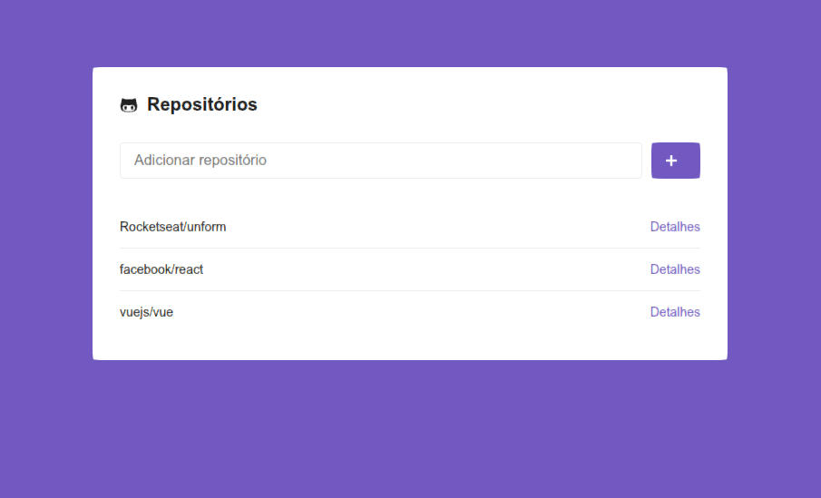
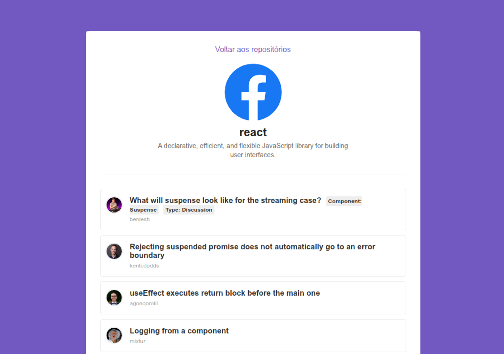

### Rocketseat Bootcamp

Foi criada uma pequena aplicação que consome
a API do GitHub. para fazer as requisições
a API foi utilizado o componente Axios.

O Rotemento de paginas é gerenciado pelo
React Router Dom.

Os componentes foram estilizados via
Styled Components.

#### Screenshots da Aplicação
Tela Inicial

Tela de detalhes do repositório

#### Criação do projeto

`yarn create react-app nome-projeto`

#### Instalações
Instalação do eslint como dev dependence

`yarn add eslint -D`

Inicialização do eslint (Verifica sintax e estilo de código)

`yarn eslint --init`

Instalação do eslint prettier

`yarn add prettier eslint-config-prettier eslint-plugin-prettier babel-eslint -D`

Aqui o babel-eslint informa o eslint 
que as ultimas versões do babel e js 
estão sendo utilizadas no projeto.

Instalação do React Router Dom

`yarn add react-router-dom`

Faz o roteamento entre páginas no frontend

Instalação da Styled Components

`yarn add styled-components`

Instalação do Pacotes de Icones

`yarn add react-icons`

Instalação do Axios para consumir API

`yarn add axios`

Instalação das PropTypes

`yarn add prop-types`

